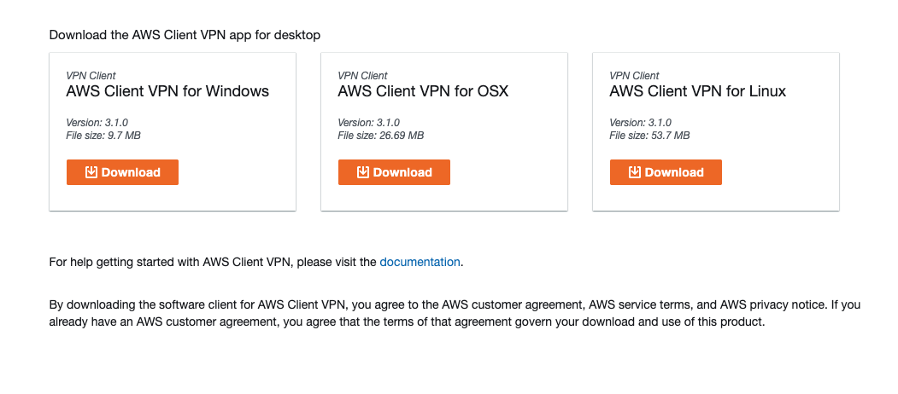
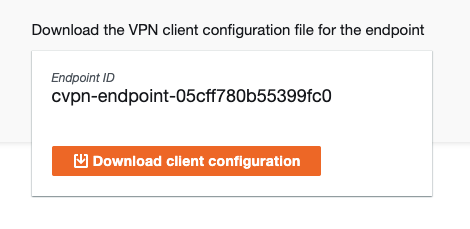
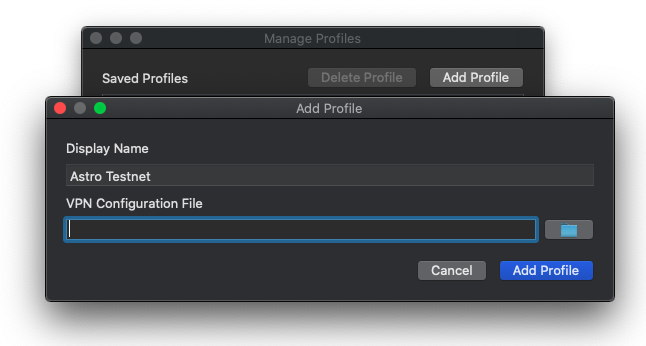
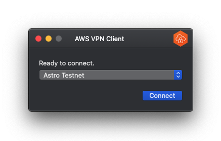
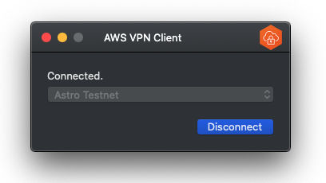

 # Local Development Setup Guide (Testnet)

### Initial Project Setup
1. Install [node](https://nodejs.org/en/) and [yarn](https://classic.yarnpkg.com/lang/en/docs/install/#mac-stable).
2. Clone the repo:
```
git clone git@github.com:near-daos/astro-api-gateway.git
```

3. Checkout to dev branch:
```
git checkout development
```

4. Install dependencies:
```
yarn
```


## VPN Setup
VPN connection is required to access Astro Indexer Database.

1. Go to self-service portal: [https://vpn.dev.astrodao.com](https://vpn.dev.astrodao.com) <br>
2. Download and install AWS Client VPN for your platform. <br>
   
3. Download the VPN client configuration file. <br>
   
4. Open AWS Client VPN, go to `File > Manage Profiles > Add Profile`. Enter display name, provide configuration file and click Add Profile. <br>
   
5. Open AWS Client VPN, select the profile and click connect. <br>
   
6. Wait until VPN connection is established. <br>
   

## Docker Setup
1. Install Docker: [https://docs.docker.com/get-docker/](https://docs.docker.com/get-docker/) <br>
2. Install Docker Compose: [https://docs.docker.com/compose/install/](https://docs.docker.com/compose/install/) <br>
3. Open console in project root folder and run: 
```shell
docker-compose -f docker-compose-dev.yml up
```

## Database Migration
After first docker start postgres database is empty, to run database migration:
```shell
yarn migration:run
```

To run dynamodb migration:
```shell
DATABASE_MIGRATIONS_LIST=DynamoTableMigration yarn start-migrations
```


## Environment variables
By default `.env` contains environment variables needed for local development besides some secrets that need to be added locally. <br>
To override or add some local env variables create `.env.local` in the root folder. <br>
List of variables that might change depending on your needs:
 - NEAR environment variables (testnet by default):
```shell
NEAR_ENV=development
NEAR_CONTRACT_NAME=sputnikv2.testnet
NEAR_TOKEN_FACTORY_CONTRACT_NAME=tokenfactory.testnet
```

 - Indexer database connection variables (public testnet indexer by default):
```shell
NEAR_INDEXER_DATABASE_HOST=35.184.214.98
NEAR_INDEXER_DATABASE_PORT=5432
NEAR_INDEXER_DATABASE_NAME=testnet_explorer
NEAR_INDEXER_DATABASE_USERNAME=public_readonly
NEAR_INDEXER_DATABASE_PASSWORD=nearprotocol
```

 - DAO database connection variables (docker's postgres by default):
```shell
DATABASE_USERNAME=sputnik
DATABASE_PASSWORD=sputnik
DATABASE_NAME=sputnik-v2
DATABASE_HOST=localhost
DATABASE_PORT=5437
```

- DynamoDB connection variables (docker's amazon/dynamodb-local by default):
```shell
DYNAMODB_REGION=local
DYNAMODB_ENDPOINT=http://localhost:8000
DYNAMODB_TABLE_NAME=entities_dev
AWS_ACCESS_KEY_ID=223344
AWS_SECRET_ACCESS_KEY=wJalrXUtTHISI/DYNAMODB/bPxRfiCYEXAMPLEKEY
```

 - Drafts database connection variables (docker's mongodb by default):
```shell
DRAFT_DATABASE_HOST=localhost
DRAFT_DATABASE_PORT=27021
DRAFT_DATABASE_USERNAME=draft
DRAFT_DATABASE_PASSWORD=draft
DRAFT_DATABASE_CERT_PATH=
```

 - Notifi config:
```shell
NOTIFI_ENV=Development
NOTIFI_SID=
NOTIFI_SECRET=
```

Note: Do not edit `.env` file as you can accidentally commit some secrets.

## Run services
After all previous steps are finished, services are ready to start. 
You can run all/some services in parallel or a single service separately dependent or your needs.

#### DAO API service
Provides a list of API endpoints (http and socket) used on Astro DAO application. <br>
 - Run service in dev mode:
```shell
yarn start-api:dev
```
 - Go to swagger: http://localhost:3000/docs

#### Aggregator service
Synchronization historical data from DAO Contracts with the Database, updating FT and NFT tokens data, storing DAO statistics <br>
 - Run service in dev mode:
```shell
yarn start-aggregator:dev
```

#### Draft service
Exposing all API endpoints used for managing draft proposal and comments on Astro UI.
 - Add `PORT=3001` to `.env.local` to avoid port conflict with DAO API service.
 - Run service in dev mode:
```shell
yarn start-draft:dev
```
- Go to swagger: http://localhost:3001/docs

#### Notifier service
Responsible for sending notifications using [Notifi](https://notifi.network/)
 - Run service in dev mode:
```shell
yarn start-notifier:dev
```

#### Indexer Processor service
Responsible for synchronization real time data from DAO Contracts with the Database. <br>
Service depends on [Astro Lake Framework](https://github.com/near-daos/astro-lake-indexer)
 - Launch [Astro Lake Framework](https://github.com/near-daos/astro-lake-indexer) locally with `redis://@localhost:6379/4`.
 - Run service in dev mode:
```shell
yarn start-indexer-processor:dev
```
