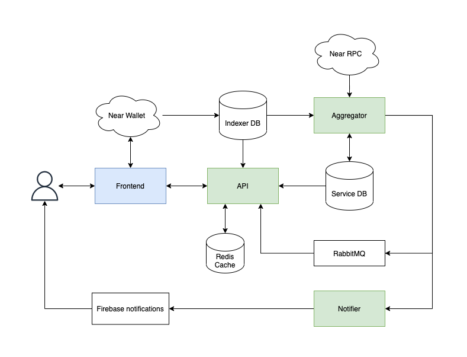
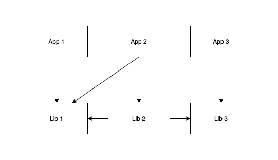

# Astro API Gateway

Astro API Gateway contains list of services used by DAO applications based on [Sputnik DAO Contracts](https://github.com/near-daos/sputnik-dao-contract) version 2 on [NEAR Protocol](https://near.org/).

Main features:
- Sync DAO Contracts data with the Database.
- Provide API endpoints to interact with DAOs.
- Produce DAO updates notifications.

## Tech Stack
- Blockchain: **[NEAR](https://near.org/)**
- Smart Contracts: **[Sputnik DAO Factory V2](https://github.com/near-daos/sputnik-dao-contract/tree/main/sputnikdao-factory2), [Sputnik DAO V2](https://github.com/near-daos/sputnik-dao-contract/tree/main/sputnikdao2)**
- Server Environment:  **[NodeJS](https://nodejs.org/)**
- Package manager: **[Yarn](https://yarnpkg.com/)**
- Core programming language: **[TypeScript](https://www.typescriptlang.org/)**
- Application framework: **[NestJS](https://nestjs.com/)**
- Database: **PostgreSQL [PostgreSQL](https://www.postgresql.org/), [TypeORM](https://typeorm.io/)**
- Near API: **[near-api-js](https://docs.near.org/docs/api/naj-quick-reference)**
- Indexer: **[NEAR Indexer for Explorer](https://github.com/near/near-indexer-for-explorer)**
- Caching: **[Redis](https://redis.io/)**
- Message broker: **[RabbitMQ](https://www.rabbitmq.com/)**
- Notifications: **[Firebase Cloud Messaging](https://firebase.google.com/docs/cloud-messaging)**
- Code quality: **[Eslint](https://eslint.org/), [Prettier](https://prettier.io/)**
- Build: **[Docker](https://www.docker.com/))**

## Services
- [Aggregator](./apps/aggregator) - sync blockchain with the Database.
- [Aggregator DAO](./apps/aggregator-dao) - temporary solution to cover implicit DAO updates that are not covered with Aggregator (is going to be removed in next iterations).
- [API](./apps/api) - provides a set of API endpoints to view, filter, search, sync etc.
- [Notifier](./apps/notifier) - simple notification service for sending / subscribing on service events.




## Project Structure

Project has standard [NestJS monorepo](https://docs.nestjs.com/cli/monorepo#monorepo-mode) structure, where all services (aggregator, api, etc.) are separated on apps.
All reusable modules separated on libs by domains and could be shared between different apps and libs itself.



### Apps
```
/apps
  /aggregator
  /aggregator-dao
  /api
  /notifier
```

### Libs
```
/libs
  /account
  /bounty
  /cache
  /common
  /config
  /dao
  /event
  /near-api
  /near-indexer
  /proposal
  /sputnikdao
  /subscription
  /token
  /transaction
  /transaction-handler
  /utils
```

## Config

Main config properties could be specified by environment variables defined in [.env](./.env) file.

All the configs are managed by [config lib](./libs/config/src) and shared between apps and libs.
```
/libs/config/src
  /aggregator-config.ts
  /aggregator-dao-config.ts
  /api-config.ts
  /cache.ts
  /configuration.ts
  /database.ts
  /database-near-indexer.ts
  /firebase.ts
  /near.ts
  /near-api.ts
  /near-config.ts
  /near-token-factory.ts
  /notifier-config.ts
  /typeorm-config.service.ts
```

---

## Getting Started

### Local Development

1. Clone the repo:
```
git clone git@github.com:near-daos/astro-api-gateway.git
```

2. Open the repo folder:
```
cd astro-api-gateway
```

3. Install dependencies:
```
yarn
```

4. Add `.env.local` to the root folder with required environment variables described in `.env`.

5. Run dev docker compose:
```
docker-compose -f docker-compose-dev.yml up
```
Please make sure that Docker has been installed on your local machine.

6. Run all services in dev mode:
```
yarn start-dev
```

Or run specific service you need:

- Aggregator: `yarn start-aggregator-dev`
- Aggregator DAO: `yarn start-aggregator-dao-dev`
- API: `yarn start-api-dev`
- Notifier: `yarn start-notifier-dev`
