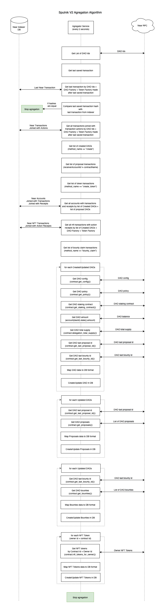
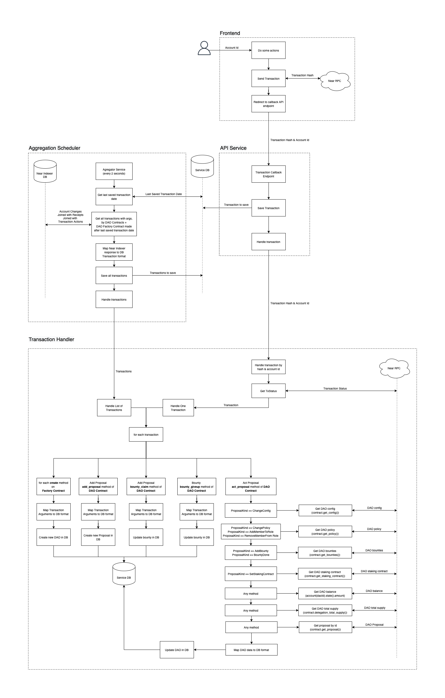

# Astro Aggregator App

Astro Aggregator App is responsible for synchronization data from DAO Contracts with the Database.

## Aggregation Algorithm v1

Schedule aggregation with interval defined in `AGGREGATOR_POLLING_INTERVAL` env variable in milliseconds (2 seconds by default):

1. Get last transaction stored in service Database.
2. Get all transactions from Near Indexer DB filtered by DAO ids and made after last saved transaction.
3. For each updated DAO get DAO data from Contract via Near RPC.
4. Map data and update service Database.

;

## Aggregation Algorithm v2

In next iterations Aggregation Algorithm is going to be improved to next one:

1. Get last saved transaction.
2. Get list of all updates from Near Indexer DB by Contract name including arguments.
3. For each update call Transaction Handler to update service Database depending on method name and arguments (If needed sync required data with Near RPC). 

;