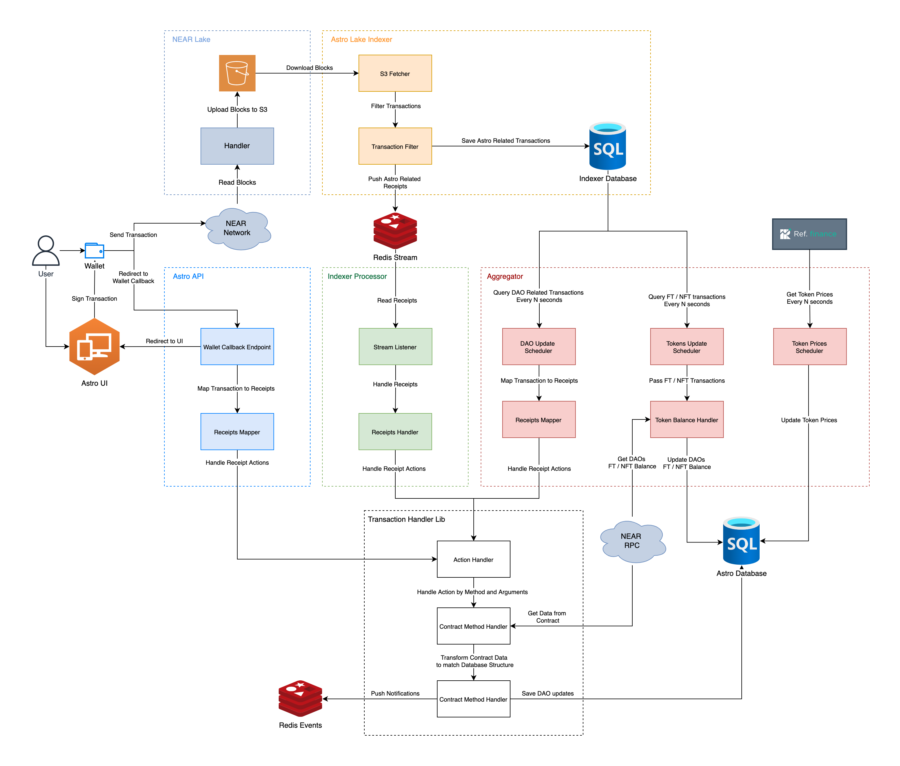

# Astro Aggregator App

Astro Aggregator App is responsible for synchronization historical data from DAO Contracts with the Database.

## Aggregation Algorithm

After starting microservice runs initial aggregation for all DAOs:
1. Get list of all DAOs.
2. For each DAO run aggregation that sync DAO data from NEAR RPC with the Database.
3. Save all transactions that has been aggregated.

When initial aggregation finished, schedule next aggregations with intervals defined in env variables:

#### DAO Updates Aggregation

1. Get last saved transaction timestamp.
2. Get list of all receipts from Indexer DB by Sputnik contract name.
3. For each update call Transaction Handler to update service Database depending on method name and arguments (If needed sync required data with Near RPC). 

Interval configured by `AGGREGATOR_POLLING_INTERVAL` env variable in milliseconds (2 seconds by default).

#### DAO Token Balance Updates Aggregation

1. Get last FT token update timestamp.
2. Get list of all likely token updates (token id + DAO) by Sputnik contract name.
3. For each Token + DAO pair get DAO token balance from RPC and update token balances in service Database.
4. Get last NFT token update timestamp.
5. Get list of all NFT events made after last update filtered by Sputnik contract.
6. For each NFT + DAO pair get DAO NFTs from RPC and update NFT owners in service Database.

Interval configured by `AGGREGATOR_TOKEN_POLLING_INTERVAL` env variable in milliseconds.

#### DAO Token Price Updates Aggregation

1. Get current token prices from [RefFinance API](https://api.stats.ref.finance/api/last-tvl)
2. Update token prices in service Database.
3. Update DAO balances due to token prices update.

Interval configured by `AGGREGATOR_TOKEN_PRICES_POLLING_INTERVAL` env variable in milliseconds.

### Contracts Sync Flow (includes Aggregator App)
;