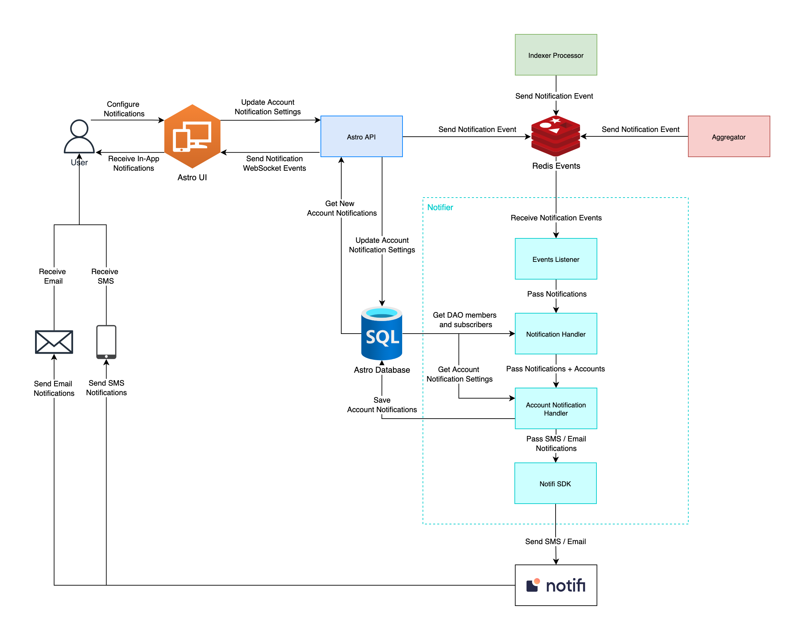

# Astro Notifier App

Astro Notifier App is responsible for sending notifications using [Notifi](https://notifi.network/).
Notifications are triggered during contracts sync flow through Redis events by API, Aggregator or Indexer Processor services.

### Notification types
Astro has next notification types:

- Notify DAO members about DAO creation.
- Notify DAO members and subscribers about proposal creation.
- Notify DAO members and subscribers about vote casting.
- Notify DAO members and subscribers about proposal approval or rejection.

### Notification subscription
Any Near account can subscribe for DAO updates.

- To subscribe for DAO updates user has to call `POST /api/v1/subscriptions` endpoint.
- To unsubscribe from DAO updates user has to call `DELETE /api/v1/subscriptions/{id}` endpoint.

### Notification configuration
Any Near account can configure what types of notification they want to receive for specific DAO or for all DAOs in general.

- To configure notifications user has to call `POST /api/v1/notification-settings` endpoint.

### SMS/Email notifications
Despite in-app notifications Astro provides an option to receive SMS and Email notifications using [Notifi service](https://notifi.network/).
If user wants to receive SMS/Email notifications they need to set and verify phone number or email.

Email verification:
- To set an email for email notifications user has to call `POST /api/v1/account/email` endpoint.
- To receive email verification code user has to call `POST /api/v1/account/email/send-verification` endpoint.
- To verify email user has to call `POST /api/v1/account/email/verify` endpoint.

SMS verification:
- To set a phone number for sms notifications user has to call `POST /api/v1/account/phone` endpoint.
- To receive phone verification code user has to call `POST /api/v1/account/phone/send-verification` endpoint.
- To verify phone number user has to call `POST /api/v1/account/phone/verify` endpoint.

Configuration:
- To configure SMS/Email notifications user has to call `POST /api/v1/notification-settings` endpoint.

### Notifications Flow
;

